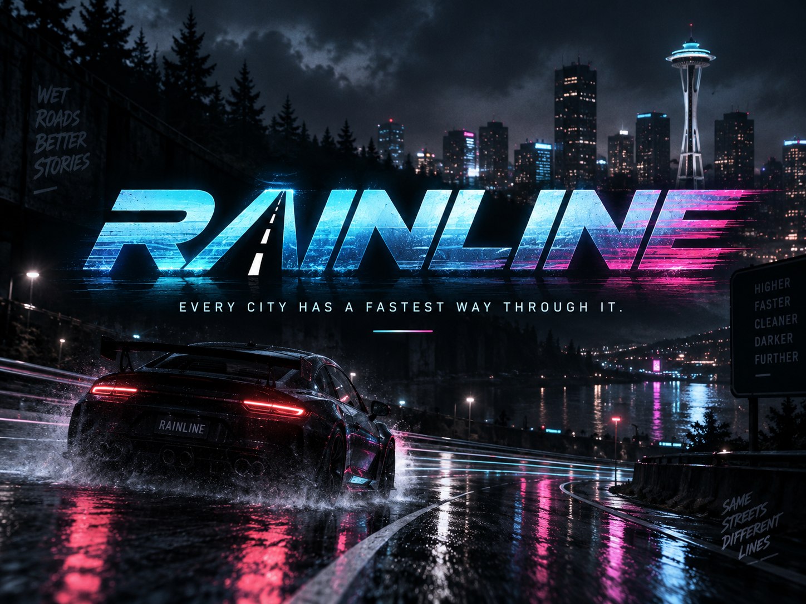

# Seattle After Dark — Rainline Run



Rainline Run is a playable Godot 4 showcase slice for **Seattle After Dark**, a single-player arcade street racer set in a fictional, Seattle-inspired Pacific Northwest city after dark. The current build is a compact downhill time attack: choose a car, descend a rain-soaked route, chain drifts and boosts, pass every checkpoint in order, and beat your local personal-best ghost.

This repository contains both the playable vertical slice and the design package that describes the intended larger game. The root Godot project is the maintained playable project. `godot_starter/` is retained as a small architecture reference and learning scaffold; it is not the project to launch for the showcase.

## Project status

| Area | Current state |
| --- | --- |
| Showcase build | Rainline Run v0.5.0 review build |
| Engine | Godot 4.7+ |
| Primary renderer | Forward+ |
| Fallback renderer | Compatibility/mobile fallback configured |
| Mode | Offline, single-player time attack |
| Route | One long downhill event with ten ordered checkpoints |
| Vehicles | Apex S, Coastline GT, Irontrail X |
| Persistence | Local personal bests, ghosts, and settings under `user://` |
| Target | 1920×1080 at 60 FPS on the target Windows GPU |
| Release shape | Showcase slice; not a complete commercial game |

Read [RELEASE_NOTES.md](RELEASE_NOTES.md) for the current build summary and known limitations.

## The project thesis

Seattle After Dark is designed around the feeling of a lost late-night arcade racer rebuilt with modern lighting and responsive controls. The city is not a backdrop pasted behind a road: hills, rain, tunnels, waterfront spaces, industrial structures, reflective asphalt, and neon route markers are all intended to influence how a short event reads at speed.

The project deliberately does not begin with a giant open world. Rainline Run is the proof point for the core loop:

1. Pick a car with a meaningful handling profile.
2. Learn a short, memorable route.
3. Use throttle, steering, handbrake, and boost to manage momentum.
4. Hit ordered gates and finish cleanly.
5. Read the result, then immediately retry to improve the time.

The development rule is simple: do not add expensive art until the car is fun on a greybox downhill course. A successful build is one that makes a tester voluntarily press **Restart** to chase a better run.

## Quick start

### Prerequisites

- Godot 4.7 or a compatible newer Godot 4 release.
- A desktop GPU capable of the Forward+ renderer. Use the in-game performance preset or the Compatibility renderer on older hardware.
- Keyboard input, or a controller recognized by Godot's standard joypad input layer.
- Optional for asset iteration: Blender 5.2+ and a Python environment for the scripts in `tools/`.

### Launch the showcase

1. Clone the repository and open its root directory in Godot.
2. Import the root `project.godot` file. Do not open `godot_starter/project.godot` unless you specifically want the small reference project.
3. Run the project, or press **F6/F5** from the Godot editor as appropriate.
4. At the title card, press **Enter** or the controller's right trigger to open the garage.
5. Choose a car, press **Enter** or the right trigger again, and complete Rainline Run.

The root scene is `scenes/main.tscn`; its script builds the route, world dressing, car, cameras, race systems, and HUD at runtime. There is intentionally no dependency on a downloaded city pack or third-party game content for the playable slice.

### Command-line launch

The project can also be opened with the Godot executable from a terminal:

```text
godot --editor --path .
godot --path . --editor
```

Use the executable name or absolute path appropriate to your installation. CI and release automation should use a pinned Godot version rather than relying on whichever executable happens to be first on `PATH`.

## Controls

The input actions are defined in `project.godot`, so the same gameplay actions are shared by keyboard and controller. The labels below describe the intended default bindings.

| Action | Keyboard | Controller | In-game use |
| --- | --- | --- | --- |
| Start / confirm | `Enter` | Right trigger / confirm | Open the garage, start a run, or retry after results |
| Throttle | `W` | Right trigger | Accelerate |
| Brake / reverse | `S` | Left trigger | Brake while moving forward; reverse at low speed |
| Steer | `A` / `D` | Left stick | Turn left or right |
| Handbrake / drift | `Space` | `A` button | Reduce lateral grip and initiate a drift at speed |
| Boost | `Shift` | `B` button | Spend the boost meter for a forward impulse and higher top speed |
| Reset / retry | `R` | `Y` button | Recover at the last safe gate, or reload after finishing |
| Pause | `Esc` | Menu / Start | Pause or resume the run |
| Camera | `C` | `X` button | Switch between chase and first-person views |
| Mute | `M` | — | Toggle audio |
| Comfort camera | `F` | — | Disable boost FOV expansion |
| Graphics preset | `V` | — | Toggle Showcase and Performance presentation |

The title card, garage, pause screen, race HUD, result card, and status messages all use the same input actions. If a controller presents different face-button labels, use the action mapping rather than the printed letter.

## How to play Rainline Run

### Garage

The garage is the first interactive screen after the title card. Use left/right input to preview the three selectable vehicles. Each card shows a short description and a relative Acceleration / Speed / Grip profile. The selected vehicle is saved to the local profile and is restored on the next launch.

### Countdown and race clock

Starting a run presents a three-second countdown. The race clock begins when the countdown reaches **GO!**, not when the garage closes. The result is calculated from the elapsed race time and the authored event thresholds.

### Checkpoints

The route contains ten ordered gates. Only the expected next gate advances the race. Crossing a gate out of order emits feedback but does not silently skip progression. The HUD shows:

- the current checkpoint count;
- a ten-light completion strip;
- the live route minimap and next gate marker;
- the distance to the next gate;
- sector feedback at the authored split points;
- the current personal-best comparison when a ghost exists.

### Drifting and boost

Hold the handbrake while steering above the minimum drift speed to reduce lateral grip and start a drift. Drift score accumulates from speed and lateral movement. A sustained drift awards a **DRIFT LINK** boost reward when it ends.

Two authored cyan track strips provide immediate forward surges at Harborfront and Blackwater Docks. They are forward impulses with a small boost-meter reward, not teleports or a bypass around the car's speed model. The normal boost button spends the vehicle's meter, increases forward acceleration, and raises the authored cruise limit while held.

### Recovery and retry

Each vehicle remembers a safe transform at a valid recovery point. `R` resets there, and the run can also recover automatically when the car is stuck against geometry or has left the route for long enough. Completing the event shows a medal, result time, target thresholds, and whether a new personal best was saved. Press `R`, `Enter`, or throttle to load a fresh attempt.

## Vehicles

The three vehicles are tuned to make route strategy matter rather than to provide three cosmetic skins.

| Vehicle | Character | Relative profile | Best fit |
| --- | --- | --- | --- |
| **Apex S** | Crimson mid-engine sports coupe | Acceleration 9 · Speed 8 · Grip 9 | Aggressive turn-in, technical bends, and confident drift exits |
| **Coastline GT** | Midnight-blue grand tourer | Acceleration 7 · Speed 10 · Grip 7 | Long waterfront straights and players who preserve momentum |
| **Irontrail X** | Storm-gray performance truck | Acceleration 6 · Speed 7 · Grip 10 | Stable recovery, planted cornering, and a larger boost reserve |

The underlying tuning lives in `scripts/main.gd` beside the vehicle definitions. The runtime applies the selected profile to `scripts/vehicle/arcade_car.gd`; the controller itself remains shared so handling changes can be evaluated across the lineup.

## Route and presentation

Rainline Run is a compact, descending urban route made from a sequence of authored points and runtime-built road segments. The current review pass is organized into distinct visual beats:

1. **Pike Market Descent** — opening city slope and S-curve.
2. **Harborfront Sweeper** — a longer, faster section with the first boost strip.
3. **Blackwater Chicane** — technical direction changes and the second boost strip.
4. **Tunnel and overpasses** — a change in lighting, audio context, and sightline.
5. **Dockyard finish** — industrial dressing, route barriers, and the illuminated Rainline finish arch.

The showcase presentation is built from a mix of runtime primitives and authored `.glb` kits:

- wet asphalt and puddle materials;
- sidewalks, curbs, retaining walls, guardrails, drains, and road decals;
- layered streetfronts, market blocks, cultural and waterfront landmarks;
- original vehicle meshes and garage preview cards;
- rain volume, emissive signage, brake lights, wheel motion, boost flames, and road spray;
- a small active OmniLight budget, fog, glow, and a moonlit night environment.

The construction islands and harbor pieces are visual-only route dressing. They should not block the intended driving line. The route uses flat cyan directional decals on the road rather than a large navigation arrow in the center of the screen; the bottom HUD remains available for the next-gate distance.

## What is implemented

### Gameplay systems

- Arcade `CharacterBody3D` vehicle controller.
- Throttle, braking, reverse, steering, handbrake drift, boost, and collision response.
- Quadratic overspeed resistance rather than a hard artificial top-speed wall.
- Automatic stuck/off-route recovery and manual reset.
- Countdown, elapsed race clock, ordered checkpoints, sector splits, medals, finish state, and fast retry.
- Two track boost strips and drift-link boost rewards.

### Ghosts and persistence

- A local ghost recorder samples the best run.
- A translucent ghost can replay the saved run on later attempts.
- Ghost data is versioned with the event handling version. A ghost from an incompatible handling version is ignored rather than replayed against different physics.
- `SaveService` uses versioned JSON in Godot's `user://` location.
- Existing profiles are copied to `user://profile.backup.json` before the current profile is written.
- If the primary profile is missing or invalid, the backup is tried; if both are unavailable, a default profile is created.

### UI and accessibility-minded options

- Garage selection with persistent vehicle choice.
- Chase and first-person camera modes.
- Comfort camera option to remove boost FOV expansion.
- Showcase / Performance graphics toggle for rain, glow, and fog intensity.
- Audio mute toggle.
- Persistent on-screen route, speed, time, checkpoint, ghost, sector, and performance feedback.

Online leaderboards, traffic, opponent AI, upgrades, campaign progression, and multiple events are not part of this slice. They remain documented as future production work rather than being implied by the current UI.

## Repository layout

```text
/
├── project.godot                 # Maintained root Godot project configuration
├── scenes/
│   └── main.tscn                 # Runtime entry scene
├── scripts/
│   ├── main.gd                   # Showcase composition and runtime world build
│   ├── vehicle/arcade_car.gd     # Shared arcade vehicle controller
│   ├── race/                     # Event, race state, checkpoints, ghost systems
│   ├── services/                 # Save and audio autoload services
│   └── ui/                       # Race HUD and route minimap
├── data/events/
│   └── rainline_run.tres          # Authored event thresholds and handling version
├── assets/
│   ├── meshes/                   # Blender source and exported glTF/GLB meshes
│   ├── textures/                 # Facade, landmark, asphalt, and streetscape art
│   ├── ui/                       # Garage cards and route decals
│   └── audio/                    # Audio asset location; currently minimal
├── tools/                        # Blender generation and preview scripts
├── tests/                        # Manual verification checklist
├── docs/                         # Design, architecture, QA, pipeline, and planning docs
├── godot_starter/                # Small standalone architecture reference
├── README.md                     # This contributor/player guide
├── RELEASE_NOTES.md              # Build-specific release notes
└── MANIFEST.json                 # Design-package manifest
```

### Script ownership

The code is intentionally split by responsibility:

- `scripts/main.gd` owns showcase composition, runtime route construction, vehicle selection, cameras, lighting, presentation effects, and wiring between systems.
- `scripts/vehicle/arcade_car.gd` owns movement, grip, drift, boost, collisions, speed signals, and recovery points. It does not directly manipulate HUD labels.
- `scripts/race/race_manager.gd` owns the countdown, timer, ordered checkpoint state, finish state, and medal calculation.
- `scripts/race/checkpoint.gd` detects gate entry and reports it to the race manager.
- `scripts/race/ghost_recorder.gd` stores a best-run sample stream, while `scripts/race/ghost_player.gd` replays it visually.
- `scripts/services/save_service.gd` owns profile defaults, schema normalization, backup behavior, and JSON reads/writes.
- `scripts/services/audio_service.gd` owns the lightweight generated audio context and mute state.
- `scripts/ui/race_hud.gd` owns the screen presentation and receives gameplay updates through explicit methods and signals.
- `scripts/ui/route_minimap.gd` draws the route and current checkpoint context.

The code follows the repository conventions in [05 — Code and Repository Guide](docs/05_CODE_AND_REPOSITORY_GUIDE.md): `snake_case` functions and variables, `PascalCase` classes, grouped exported tuning values, signals near the top of a script, and comments that explain non-obvious design decisions.

## Event data and save data

The current event is defined in `data/events/rainline_run.tres`:

| Field | Value |
| --- | --- |
| Event ID | `rainline_run` |
| Scene | `res://scenes/main.tscn` |
| Weather profile | `drizzle_night` |
| Handling version | `rainline_v1` |
| Gold target | 2:35.000 |
| Silver target | 3:00.000 |
| Bronze target | 3:30.000 |

The save service currently writes a profile shaped like this to `user://profile.json`:

```json
{
  "schema_version": 2,
  "best_times_ms": {
    "rainline_run": 143882
  },
  "ghosts": {
    "rainline_run": {
      "handling_version": "rainline_v1",
      "time_ms": 143882,
      "samples": []
    }
  },
  "settings": {
    "graphics": "showcase",
    "first_person_camera": false,
    "comfort_camera": false,
    "selected_vehicle": 0
  }
}
```

The sample array is abbreviated above for readability. Do not edit the profile while the game is running unless you are intentionally testing recovery. To test the fallback path, move or corrupt the primary profile and relaunch; the game should use the backup when it is valid and should otherwise create a fresh profile without crashing.

## Rendering and performance

The project defaults to Forward+ for the wet-night showcase and declares Compatibility as its mobile fallback. The Performance preset is exposed with `V` and currently reduces presentation cost by disabling the rain volume and glow while reducing fog density. The HUD also reports sampled FPS, draw calls, and visible object count during a run.

Performance guidance:

- Use the root project and a clean Godot import when profiling.
- Test at the intended 1920×1080 baseline before drawing conclusions from an editor window.
- Compare Showcase and Performance presets on the same route section.
- Keep the active OmniLight count intentionally small; much of the city color comes from emissive materials rather than individual realtime lights.
- Avoid adding per-frame global node searches or high-frequency allocations to the race loop.
- Profile Forward+ and Compatibility separately; a renderer change can alter both GPU and visual behavior.

The target of 60 FPS is a showcase goal, not a guarantee on every integrated GPU. The build exposes enough runtime counters to make a regression visible during review.

## Asset workflow

The editable Blender generators live in `tools/`. They create original vehicle, streetfront, landmark, and modular-kit source assets and export `.glb` files into `assets/meshes/`. The gameplay scene can run with its runtime primitive geometry, while the authored kits provide denser presentation and replaceable art.

Typical Blender workflow:

1. Open the relevant `.blend` source or run its generator from Blender's background Python mode.
2. Export or regenerate the intended `.glb` asset.
3. Place preview renders and texture outputs in the matching `assets/` subdirectory.
4. Open the root project in Godot and allow the editor to import the asset.
5. Run the showcase and inspect both the chase view and first-person view.

The repository intentionally ignores Godot import caches, Blender `.blend1` backups, Python environments, and `tmp/` capture output. Keep source `.blend`, exported `.glb`, authored textures, and final UI images under `assets/` when they are part of the build.

## Verification checklist

The short manual regression pass is maintained in [tests/README.md](tests/README.md). At minimum, verify:

1. A clean Godot import launches the title card and rainy scene.
2. The garage previews all three cars, changes selection, and persists the selection after relaunch.
3. Each vehicle has a distinct acceleration, speed, grip, and boost profile.
4. Keyboard and controller input cover throttle, brake/reverse, steering, drift, boost, reset, and pause.
5. Chase and first-person cameras switch immediately and persist after relaunch.
6. Wrong-order checkpoint entry does not advance the race.
7. The checkpoint strip, route minimap, sector messages, boost strips, drift-link reward, and ghost comparison behave as expected.
8. Finishing shows the correct medal threshold, result time, and personal-best state.
9. A second run can be started immediately, and a faster run replaces the stored ghost.
10. A missing or corrupt primary profile falls back to the backup or a clean default profile.
11. The Performance preset changes the intended effects and the HUD reports usable performance counters.

There is no automated test runner in the current slice. Pure race logic and save migration are good candidates for future unit tests; the existing checklist is the source of truth for the current showcase review.

## Troubleshooting

### The wrong project opens

Open the repository root and select the root `project.godot`. `godot_starter/` is a separate reference project and is not the showcase entry point. The nested `rainline/` directory contains editor-generated project metadata and is not required for normal launch.

### The screen is black or effects are too expensive

Press `V` to switch to the Performance preset. If Forward+ is unsupported, open the project with a Compatibility-capable renderer and verify that the GPU drivers are current. Delete only the relevant Godot import cache if an asset import is stale, then reopen the project and allow a clean reimport.

### A run appears stuck

Press `R` to recover at the last safe gate. The controller also recovers after a prolonged collision or when the car has been off-route for long enough. If the game is paused, `R` performs recovery and resumes the run.

### The ghost is not visible

A ghost is only recorded after a personal best. It is also rejected when its saved `handling_version` does not match the event definition. Complete a fresh run or remove the incompatible `user://profile.json` and `user://profile.backup.json` files when intentionally resetting local state.

### The editor reports missing imported resources

Do not commit `.import` caches. Confirm that the source `.glb`, `.blend`, texture, or UI file exists under `assets/`, then let Godot reimport from the root project. Missing-resource errors should be fixed at the source path rather than by checking generated cache files into Git.

## Design package

The repository includes a deliberately broad design package for the eventual game. Start with these documents depending on what you are doing:

- [01 — Game Design Document](docs/01_GAME_DESIGN_DOCUMENT.md) for the product vision and pillars.
- [02 — Story Bible](docs/02_STORY_BIBLE.md) for tone, characters, and narrative framing.
- [03 — World and Tracks](docs/03_WORLD_AND_TRACKS.md) for district and route direction.
- [04 — Technical Architecture](docs/04_TECHNICAL_ARCHITECTURE.md) for runtime ownership and platform targets.
- [05 — Code and Repository Guide](docs/05_CODE_AND_REPOSITORY_GUIDE.md) for style, branching, and test expectations.
- [06 — Vehicle Handling and Balance](docs/06_VEHICLE_HANDLING_AND_BALANCE.md) for tuning goals.
- [07 — AI, Ghosts, and Traffic](docs/07_AI_GHOSTS_AND_TRAFFIC.md) for future opponent systems.
- [08 — UI, UX, and Accessibility](docs/08_UI_UX_ACCESSIBILITY.md) for interface and comfort direction.
- [09 — Art, Audio, and Content Pipeline](docs/09_ART_AUDIO_AND_CONTENT_PIPELINE.md) for production standards.
- [10 — Integrations and Services](docs/10_INTEGRATIONS_AND_SERVICES.md) for optional online/platform services.
- [11 — Production Roadmap](docs/11_PRODUCTION_ROADMAP.md) for milestone sequencing and scope control.
- [12 — QA, Release, and Operations](docs/12_QA_RELEASE_AND_OPERATIONS.md) for test matrices and shipping gates.
- [13 — Asset Manifest](docs/13_ASSET_MANIFEST.md) for content inventory and sourcing notes.
- [14 — Telemetry and Playtesting](docs/14_TELEMETRY_AND_PLAYTESTING.md) for future measurement plans.
- [15 — Store, Marketing, and Community](docs/15_STORE_MARKETING_AND_COMMUNITY.md) for future public-facing work.
- [BUG_REPORT_TEMPLATE.md](docs/BUG_REPORT_TEMPLATE.md) and [DECISION_LOG_TEMPLATE.md](docs/DECISION_LOG_TEMPLATE.md) for project records.

## Roadmap and known limitations

The current build is a vertical-slice proof, not a content-complete game. The next layers described in the design package include:

- additional race events and districts;
- traffic and rival AI;
- vehicle upgrades and progression;
- campaign and story presentation;
- more robust settings, accessibility, localization, and input remapping;
- platform packaging, signing, achievements, and optional online services;
- automated tests, headless import checks, and export artifacts.

The scope-kill order in the roadmap protects the things this slice is proving: handling quality, readable routes, fast restart, stable saves, and accessibility basics. Free roam, cockpit interiors, advanced traffic, extra vehicles, photo mode, and online cross-platform leaderboards should not be treated as hidden promises of this repository state.

## Contribution workflow

Keep `main` playable and use short-lived branches for changes. A typical documentation or gameplay change should:

1. Start from an up-to-date `main`.
2. Create a focused `codex/…` or feature branch.
3. Make the smallest coherent change.
4. Run the manual regression checks that cover the affected system.
5. Record new tuning, assets, save changes, or known limitations in the relevant documentation.
6. Open a pull request with a detailed summary, test evidence, screenshots or video when presentation changed, and any follow-up work.

For GDScript, prefer typed variables where practical, explicit signals, and comments about units or non-obvious formulas. For assets, keep editable sources and exported runtime files traceable. Never commit secrets, machine-local profiles, Godot import caches, Python environments, or temporary capture output.

## License and distribution note

This repository is currently a development/showcase package. Before public or commercial distribution, add an explicit project license, asset-source and attribution records, third-party notices, platform signing metadata, and a reproducible export process. The design intends original project geometry and locally generated presentation assets, but every dependency and source file should still be verified before release.

## Credits

Seattle After Dark and Rainline Run are the project concepts represented by this repository. The current slice is built around Godot, GDScript, Blender-authored `.glb` assets, procedural route construction, and a neon wet-night presentation.
